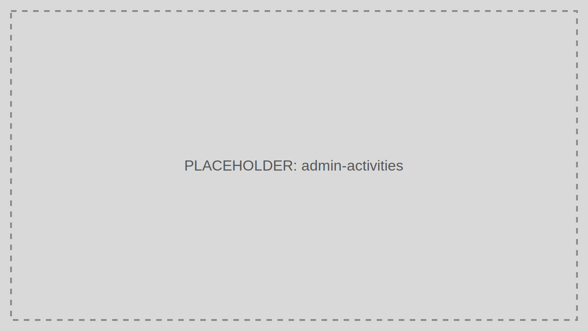

# Activities

Activities provides the audit trail for security-relevant and administrative actions across TokenIDP.

> Audience: Developers, CTOs
>
> Read this page when investigating incidents, tracing operator actions, or confirming change history.

## What This Feature Is For

Use Activities to review who performed an action, what changed, when it happened, and which Tenant or target object was involved.

## Workflow

1. Open Activities.
2. Filter by time, actor, severity, or target type.
3. Open a record.
4. Correlate with runtime logs and support tickets.

## Working Example

Filter for high-severity token events during an incident window to confirm whether a token was revoked before an API misuse report.

## Common Pitfalls

- Searching without narrowing the time window.
- Treating activities as a replacement for raw infrastructure logs.

## Troubleshooting Tips

- If you cannot connect two events, use the correlation identifier and actor details to join portal and API-side logs.
