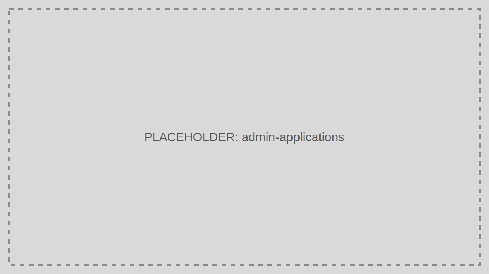

# Applications

Applications are the registered OAuth clients that request tokens from TokenIDP.

> Audience: Developers, CTOs
>
> Read this page when creating, rotating, or reviewing client registrations.

## What This Feature Is For

Use Applications to manage Client IDs, allowed grant types, redirect URIs, logout redirect URIs, scopes, and secret lifecycle.

## Workflow

1. Open Applications.
2. Select Create Application.
3. Choose public or confidential client type.
4. Configure redirect URIs, logout URIs, scopes, and grant types.
5. Save and record the generated credentials securely.

## Working Example

Create one confidential Application for a background worker and grant only `orders.read`, not the broader scopes used by your portal.

## Common Pitfalls

- Reusing one Application for unrelated workloads.
- Registering wildcard redirect URIs.
- Leaving unused grant types enabled.

## Troubleshooting Tips

- If login fails, compare the runtime request values against the exact Application configuration.
