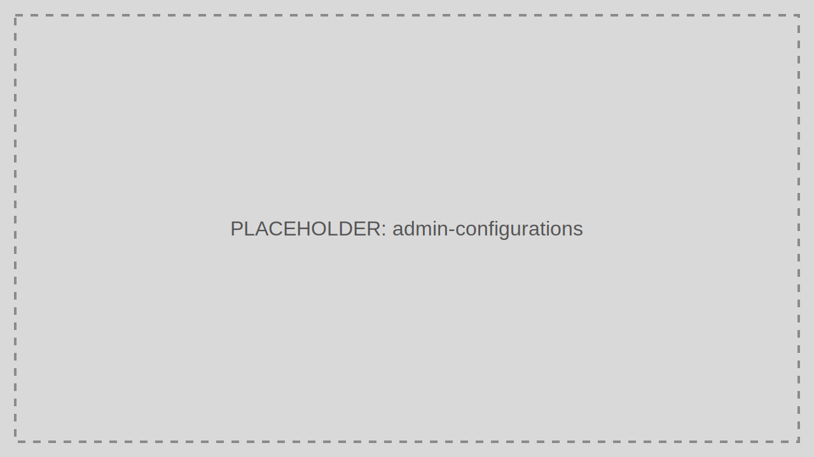

# Configurations

Configurations manages tenant-level operational settings and feature controls.

> Audience: Developers, CTOs
>
> Read this page when adjusting runtime behavior without changing application code.

## What This Feature Is For

Use Configurations to update tenant-specific settings, feature flags, and operational values used by TokenIDP components.

## Workflow

1. Open Configurations.
2. Search for the setting key.
3. Edit the value with a clear change reason.
4. Save and validate the runtime effect.

## Working Example

Update a tenant-specific session or policy value in staging first, validate the outcome, then repeat the change in production under change control.

## Common Pitfalls

- Making direct production changes without documenting intent.
- Forgetting that some values may be cached temporarily.

## Troubleshooting Tips

- If a change does not appear immediately, inspect configuration cache behavior and any dependent service restarts.
