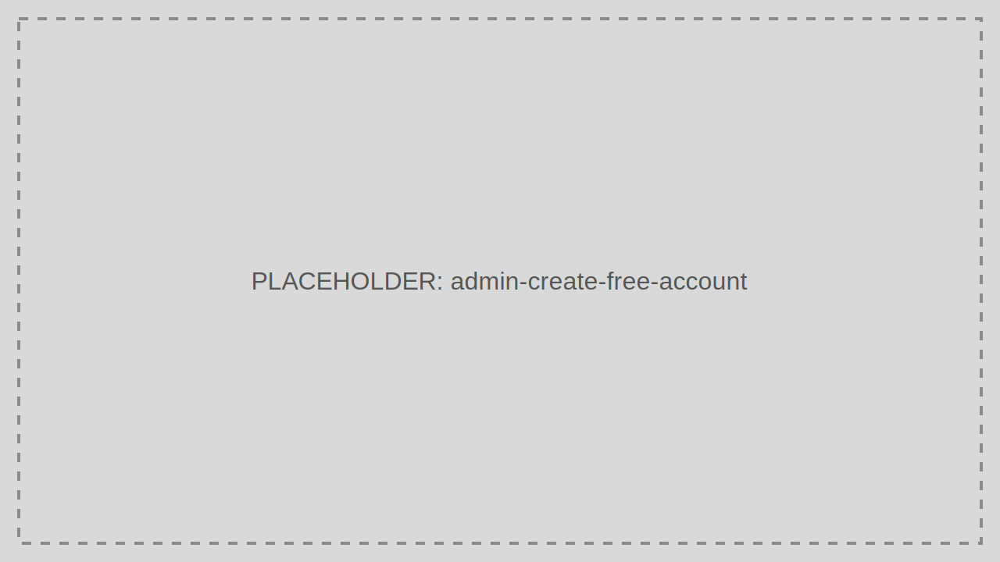

# Create Free Account

Create Free Account covers the self-service onboarding path for a new tenant or trial organization.

> Audience: Marketing, CTOs, Developers
>
> Read this page when designing or supporting the first-touch onboarding experience.

## What This Feature Is For

Use Create Free Account to onboard new organizations with a guided sign-up, initial admin user, and starter tenant configuration.

## Workflow

1. Open the sign-up entry point.
2. Enter organization and administrator details.
3. Verify email ownership.
4. Create the initial Tenant and admin identity.
5. Complete the first-login and setup checklist.

## Working Example

Route new trial users into a minimal starter Tenant, then guide them to Applications, Users, and branding setup after the first login.

## Common Pitfalls

- Capturing too much information on the first screen and hurting conversion.
- Creating a Tenant before verifying ownership of the admin email.

## Troubleshooting Tips

- If new accounts are created but onboarding stops midway, inspect provisioning logs, email verification, and post-signup redirects.
