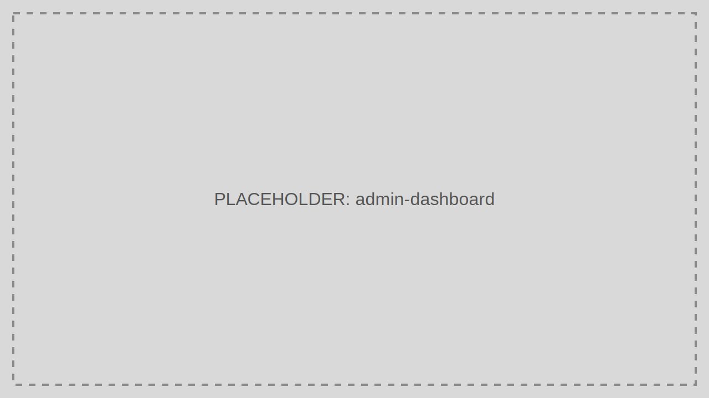

# Dashboard

The Dashboard gives operators a fast view of tenant health, user activity, token posture, and expiring client secrets.

> Audience: CTOs, Developers, Marketing
>
> Read this page when you need a quick operational snapshot of a Tenant.

## What This Feature Is For

Use the Dashboard to spot unusual activity, onboarding progress, expiring secrets, and operational exceptions without querying the database directly.

## Workflow

1. Sign in to the Admin Portal.
2. Select the Tenant context.
3. Open Dashboard.
4. Review summary cards and time-based trends.
5. Drill into detailed pages when a metric looks abnormal.

## Working Example

Review the expiring client-secret widget weekly and rotate any secret approaching its expiration window before dependent services fail.

## Common Pitfalls

- Treating dashboard totals as a substitute for audit detail.
- Ignoring Tenant context and reading the wrong environment.

## Troubleshooting Tips

- If counts look stale, inspect cache freshness and recent activity ingestion.
