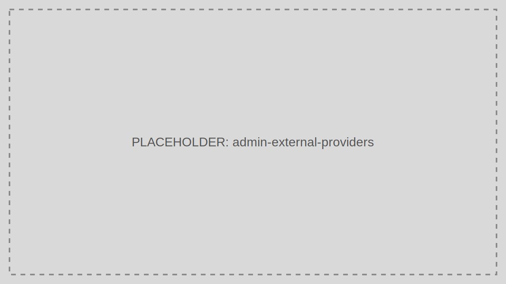

# External Providers Management

External Providers Management controls third-party identity connections such as enterprise or social login providers.

> Audience: Developers, CTOs, Marketing
>
> Read this page when onboarding external identity providers into TokenIDP.

## What This Feature Is For

Use this feature to connect outside identity systems while keeping tenant ownership, user mapping, and policy enforcement inside TokenIDP.

## Workflow

1. Open External Providers Management.
2. Create a new provider entry.
3. Enter issuer, client, secret, and callback details.
4. Map claims and enable the provider.
5. Test login in a non-production environment first.

## Working Example

Add an enterprise OpenID Connect provider for one Tenant while leaving other Tenants on local login only.

## Common Pitfalls

- Enabling a provider globally when it should be tenant-scoped.
- Not validating claim mapping before rollout.

## Troubleshooting Tips

- If sign-in succeeds at the external provider but fails on return, inspect callback configuration, claim mapping, and tenant routing.
