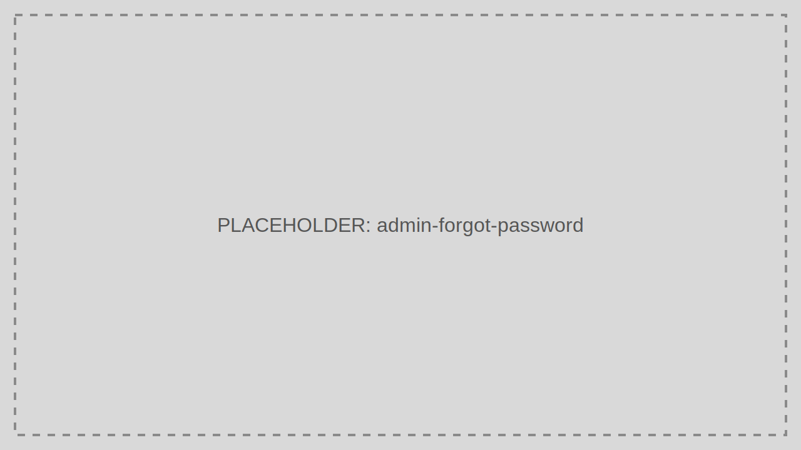

# Forgot Password

Forgot Password describes the self-service recovery path that end users use when they cannot remember their password.

> Audience: Developers, CTOs, Marketing
>
> Read this page when configuring or supporting self-service account recovery.

## What This Feature Is For

Use Forgot Password to reduce support load while keeping password recovery auditable and time-bound.

## Workflow

1. The user selects Forgot Password on the sign-in screen.
2. The user submits their email or username.
3. TokenIDP issues a reset flow.
4. The user proves possession of the recovery channel.
5. The user sets a new password and signs in again.

## Working Example

Document the exact user-facing recovery steps in your support playbook so first-line support does not hand out insecure workarounds.

## Common Pitfalls

- Revealing too much account existence information in the recovery UI.
- Allowing overly long-lived recovery links.

## Troubleshooting Tips

- If recovery emails are not arriving, verify delivery infrastructure before assuming user error.
