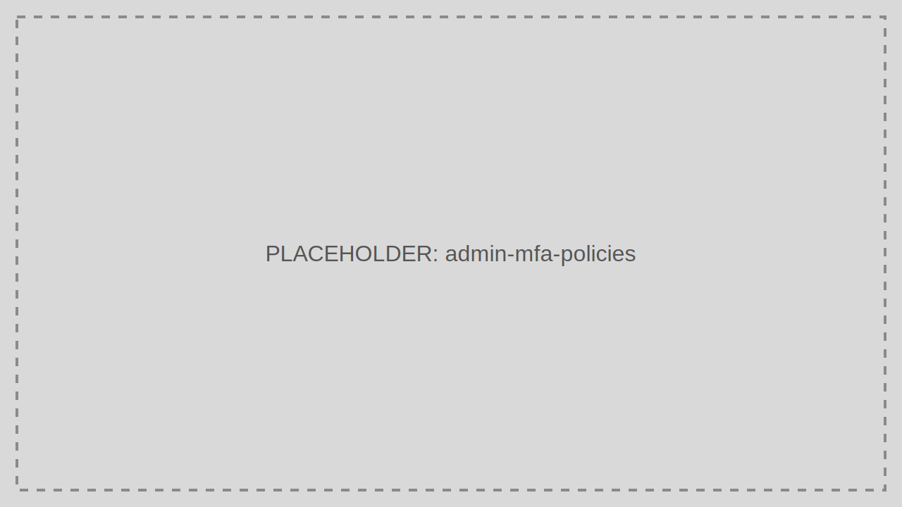

# MFA Policies

MFA Policies control when additional verification is required during authentication.

> Audience: Developers, CTOs
>
> Read this page when hardening login policy for administrators or higher-risk users.

## What This Feature Is For

Use MFA Policies to require stronger verification for privileged access, risky events, or tenant-wide security posture upgrades.

## Workflow

1. Open MFA Policies.
2. Review the current enforcement scope.
3. Create or edit a policy.
4. Assign the policy to the target population.
5. Validate the login flow in a controlled environment.

## Working Example

Require MFA for all Admin Portal users while allowing lower-friction login for low-risk customer portals.

## Common Pitfalls

- Enabling MFA broadly without validating delivery and recovery paths.
- Forgetting to test administrator break-glass access.

## Troubleshooting Tips

- If users are stuck in MFA loops, inspect correlation IDs across the authentication and MFA logs.
