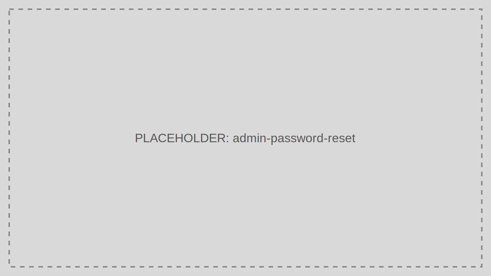

# Password Reset

Password Reset lets administrators trigger or complete controlled password reset workflows for users.

> Audience: Developers, CTOs
>
> Read this page when supporting locked-out users or enforcing credential recovery.

## What This Feature Is For

Use Password Reset for supported, auditable credential recovery initiated by an administrator or service desk workflow.

## Workflow

1. Open Password Reset.
2. Locate the user.
3. Initiate the reset workflow.
4. Confirm the user receives the reset instructions or temporary credential path.
5. Review completion status in Activities.

## Working Example

Reset an admin account after a failed sign-in lockout, then require the user to choose a new password on next login.

## Common Pitfalls

- Resetting the wrong user because of weak search filters.
- Sending resets repeatedly instead of checking whether a valid reset is already outstanding.

## Troubleshooting Tips

- If a reset appears to succeed but the user cannot continue, inspect email delivery, expiry windows, and the recorded correlation ID.
