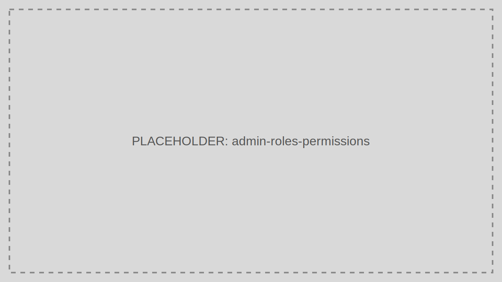

# Roles and Permissions

Roles group access rules for both Admin Portal capabilities and application-facing authorization.

> Audience: Developers, CTOs
>
> Read this page when designing least-privilege access in TokenIDP.

## What This Feature Is For

Use Roles and Permissions to model who can administer Tenants, manage users, rotate secrets, and access protected business features.

## Workflow

1. Open Roles and Permissions.
2. Create or edit a Role.
3. Attach permissions intentionally.
4. Assign the Role to Users or groups.
5. Validate effective access in a non-production environment.

## Working Example

Create a `SupportAgent` role that can view activities and user details but cannot revoke tokens or modify Applications.

## Common Pitfalls

- Creating one broad administrator role for every operator.
- Treating Role names as documentation without reviewing the actual permissions.

## Troubleshooting Tips

- If a user sees too much or too little in the portal, inspect the resolved permission set rather than only the Role label.
