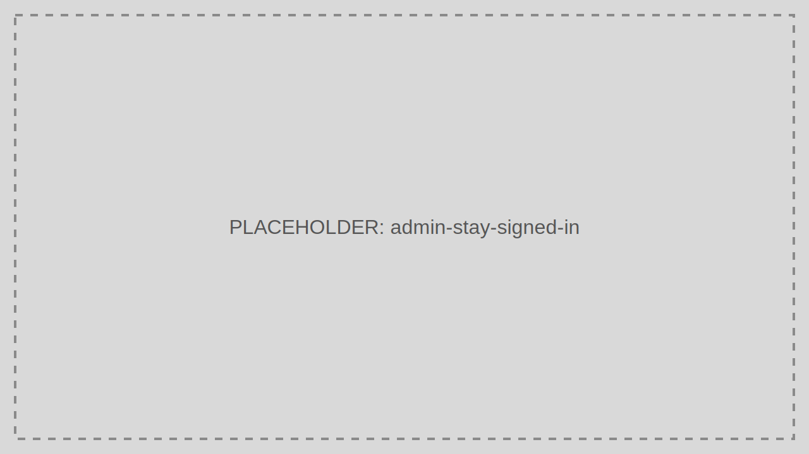

# Stay Signed In

Stay Signed In controls how long browser sessions persist and whether users are prompted to extend them.

> Audience: Developers, CTOs
>
> Read this page when balancing user convenience against session risk.

## What This Feature Is For

Use Stay Signed In settings to tune session persistence for browser-based applications and the Admin Portal.

## Workflow

1. Open Stay Signed In settings.
2. Review current session lifetime and remember-me behavior.
3. Update the policy.
4. Validate sign-in, browser restart, and logout behavior.

## Working Example

Use shorter persistence for the Admin Portal than for a low-risk customer dashboard.

## Common Pitfalls

- Applying long-lived sessions to privileged admin users.
- Forgetting shared-device scenarios.

## Troubleshooting Tips

- If users are logged out unexpectedly, compare the configured session lifetime to cookie expiry and token lifetime.
