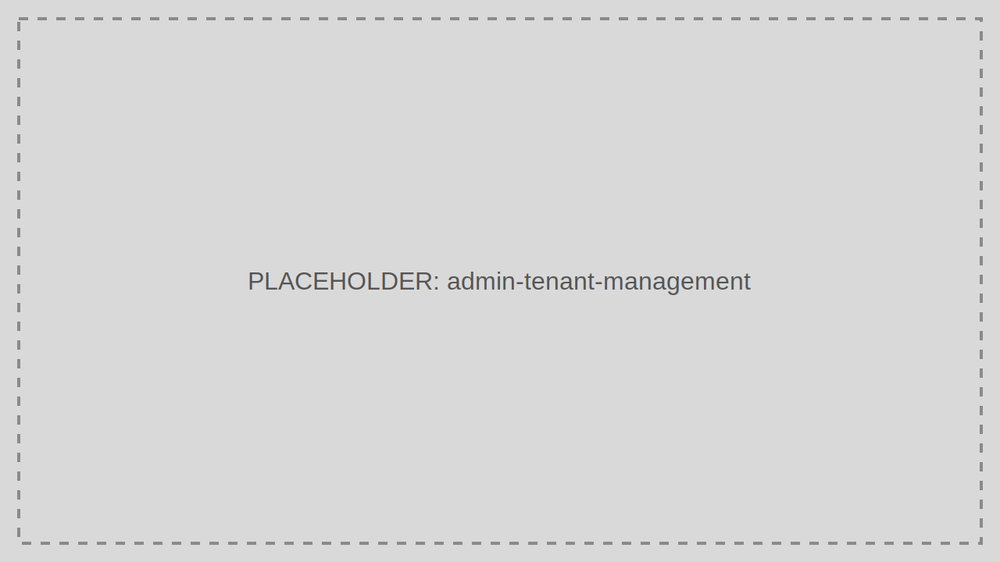

# Tenant Management

Tenant Management controls the isolation boundary for customers, business units, or environments.

> Audience: CTOs, Developers
>
> Read this page when onboarding or maintaining a Tenant in TokenIDP.

## What This Feature Is For

Use Tenant Management to create and maintain tenant-level identity settings, branding, policies, and ownership.

## Workflow

1. Open Tenant Management.
2. Create or select a Tenant.
3. Update identity, contact, and policy settings.
4. Save changes and confirm downstream applications use the correct Tenant context.

## Working Example

Create separate Tenants for staging and production so user populations, Applications, and secrets stay isolated.

## Common Pitfalls

- Sharing a Tenant across unrelated customers.
- Editing the wrong Tenant because the portal context was not verified first.

## Troubleshooting Tips

- If changes appear in the wrong place, confirm the active Tenant selector before investigating deeper.
