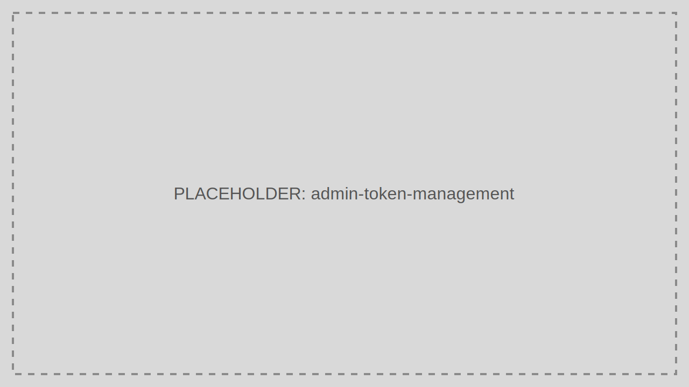

# Token Management

Token Management helps operators inspect and revoke tokens, investigate suspicious sessions, and support incident response.

> Audience: Developers, CTOs
>
> Read this page when you need direct operational control over issued tokens.

## What This Feature Is For

Use Token Management to locate active tokens, inspect expiry, revoke refresh capability, and track token-related incidents.

## Workflow

1. Open Token Management.
2. Search by user, client, or token identifier.
3. Review status and expiry details.
4. Revoke the token if needed.
5. Capture the reason for audit and support follow-up.

## Working Example

When a laptop is reported stolen, revoke the user's active Refresh Tokens and review recent token issuance activity for unusual patterns.

## Common Pitfalls

- Assuming token revocation retroactively invalidates every already-issued Access Token immediately.
- Revoking tokens without documenting the reason.

## Troubleshooting Tips

- If a user remains active after revocation, compare the revoked token to any newer rotated token in the same session chain.
