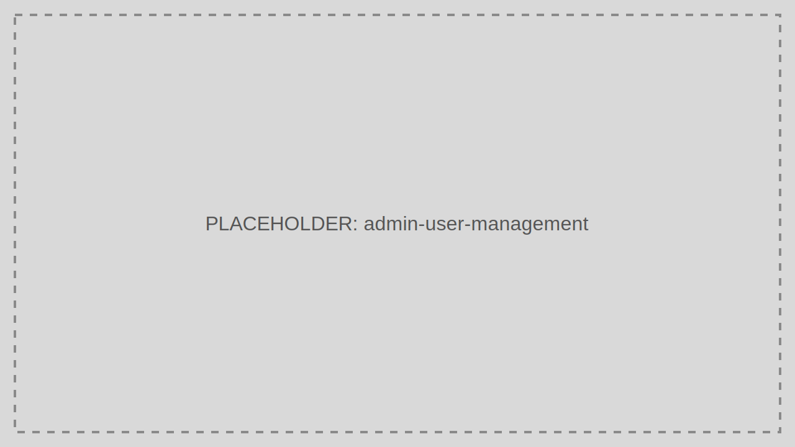

# User Management

User Management controls identities, status, and lifecycle actions for end users and operators.

> Audience: Developers, CTOs
>
> Read this page when creating, updating, disabling, or investigating users.

## What This Feature Is For

Use User Management to onboard users, assign them to Roles, verify profile status, and manage account state changes.

## Workflow

1. Open User Management.
2. Search by username, email, or status.
3. Open the user record.
4. Update profile, role assignments, or status.
5. Save and review the activity trail.

## Working Example

Disable a user immediately after an offboarding event and revoke active Refresh Tokens through Token Management if policy requires immediate session shutdown.

## Common Pitfalls

- Disabling a user without also checking active sessions.
- Using personal admin accounts for bulk operational changes.

## Troubleshooting Tips

- If a disabled user still accesses an API, inspect whether a previously issued Access Token is still within lifetime.
