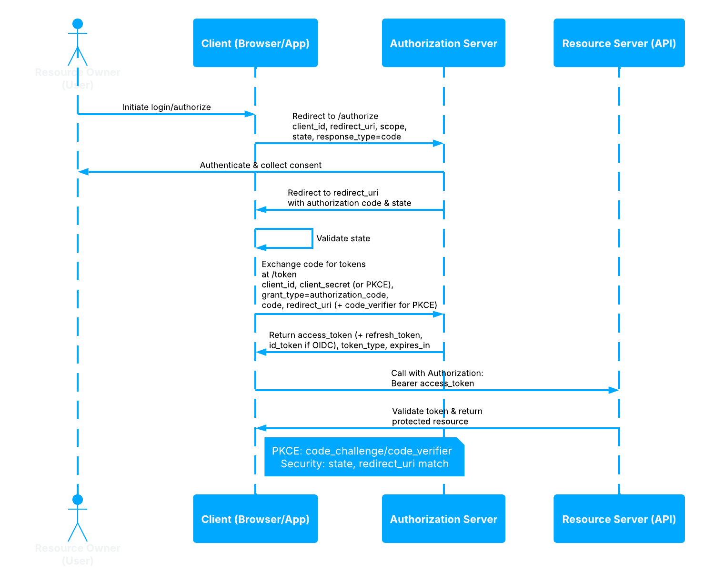

# Authorization Code + PKCE

Implement the recommended browser and mobile app flow for TokenIDP.

> Audience: Developers, CTOs
>
> Read this guide when your client cannot safely keep a client secret, such as a SPA or mobile app.

> Prerequisites
>
> - Public Application registration
> - Exact redirect URI registered in TokenIDP
> - PKCE code verifier and `S256` code challenge support in the client



## Step-by-Step Sequence

1. The client creates a high-entropy code verifier.
2. The client derives an `S256` code challenge.
3. The browser is redirected to `/authorize`.
4. The user authenticates and grants consent if required.
5. TokenIDP redirects back with an authorization code.
6. The client posts the code and `code_verifier` to `/token`.
7. TokenIDP verifies the PKCE binding and returns tokens.

## Working Example

## Example Authorization Request

```http
GET /authorize?client_id=tokenidp-react-dev&redirect_uri=http%3A%2F%2Flocalhost%3A5173%2Fcallback&response_type=code&scope=openid%20profile%20email%20offline_access%20api.read&state=af0ifjsldkj&code_challenge=E9Melhoa2OwvFrEMTJguCHaoeK1t8URWbuGJSstw-cM&code_challenge_method=S256 HTTP/1.1
Host: localhost:5001
```

## Example Token Request

```bash
curl -X POST https://localhost:5001/token \
  -H "Content-Type: application/json" \
  -d '{
    "grantType": "authorization_code",
    "clientId": "tokenidp-react-dev",
    "code": "SplxlOBeZQQYbYS6WxSbIA",
    "redirectUri": "http://localhost:5173/callback",
    "codeVerifier": "dBjftJeZ4CVP-mB92K27uhbUJU1p1r_wW1gFWFOEjXk"
  }'
```

## Example Response

```json
{
  "isSuccess": true,
  "data": {
    "accessToken": "eyJhbGciOiJSUzI1NiIsImtpZCI6IjIwMjYtMDMtMTYifQ...",
    "refreshToken": "8d2a5d18-b8cb-44b9-9d5c-bccaf4877baf",
    "idToken": "eyJhbGciOiJSUzI1NiIsImtpZCI6IjIwMjYtMDMtMTYifQ...",
    "tokenType": "Bearer",
    "expiresIn": 3600
  }
}
```

## When to Use

- SPAs
- Native mobile applications
- Desktop applications

## When Not to Use

- Server-to-server integrations that can safely use client authentication
- Legacy clients that cannot preserve PKCE state correctly

## Security Notes

- TokenIDP requires `response_type=code` and PKCE parameters on `/authorize`.
- Use exact redirect URI matching.
- Keep `state` unpredictable and validate it on return.
- Prefer short-lived Access Tokens and rotated Refresh Tokens.

## Common Pitfalls

- Sending `code_challenge_method=plain` when the client expects `S256`.
- Exchanging the code with a different redirect URI than the one used on `/authorize`.
- Logging the raw authorization code in browser telemetry.

## Troubleshooting Tips

- If `/authorize` returns `Missing PKCE parameters.`, verify both `code_challenge` and `code_challenge_method`.
- If `/token` rejects the code, confirm the code verifier belongs to the same browser session and login attempt.
