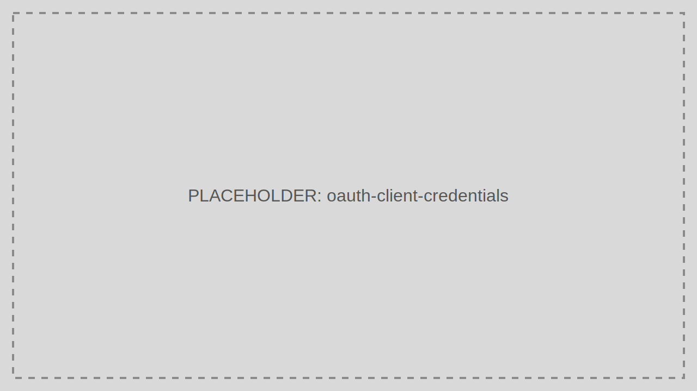

# Client Credentials

Issue Access Tokens for machine-to-machine calls where no end user is present.

> Audience: Developers, CTOs
>
> Read this guide when an Application calls an API on its own behalf.

> Prerequisites
>
> - Confidential Application registration
> - Client secret stored outside the browser
> - API scopes granted to the Application



## Step-by-Step Sequence

1. The calling service authenticates with its Client ID and secret.
2. The service requests the scopes it needs.
3. TokenIDP verifies the Application and grant permissions.
4. TokenIDP returns an Access Token.
5. The service presents the token to the target API.

## Working Example

## Example Request

```bash
curl -X POST https://localhost:5001/token \
  -H "Content-Type: application/json" \
  -d '{
    "grantType": "client_credentials",
    "clientId": "orders-worker",
    "clientSecret": "replace-with-real-secret",
    "scope": "orders.read orders.write"
  }'
```

## Example Response

```json
{
  "isSuccess": true,
  "data": {
    "accessToken": "eyJhbGciOiJSUzI1NiIsImtpZCI6IjIwMjYtMDMtMTYifQ...",
    "tokenType": "Bearer",
    "expiresIn": 3600
  }
}
```

## When to Use

- Background jobs
- API-to-API calls
- Daemons and schedulers

## When Not to Use

- Browser applications
- Native mobile apps
- Any client that cannot protect a client secret

## Security Notes

- Store the Client secret in a secret manager, not in source control.
- Grant only the scopes the service actually needs.
- Separate Applications by workload instead of sharing one secret across all services.

## Common Pitfalls

- Using Client Credentials where user identity and user consent are required.
- Requesting all scopes for operational convenience.
- Embedding the secret into front-end code.

## Troubleshooting Tips

- If the request is rejected, confirm the Application is active and allowed to use the `client_credentials` grant.
- If the API denies access, inspect the token claims to confirm the expected scopes were issued.
