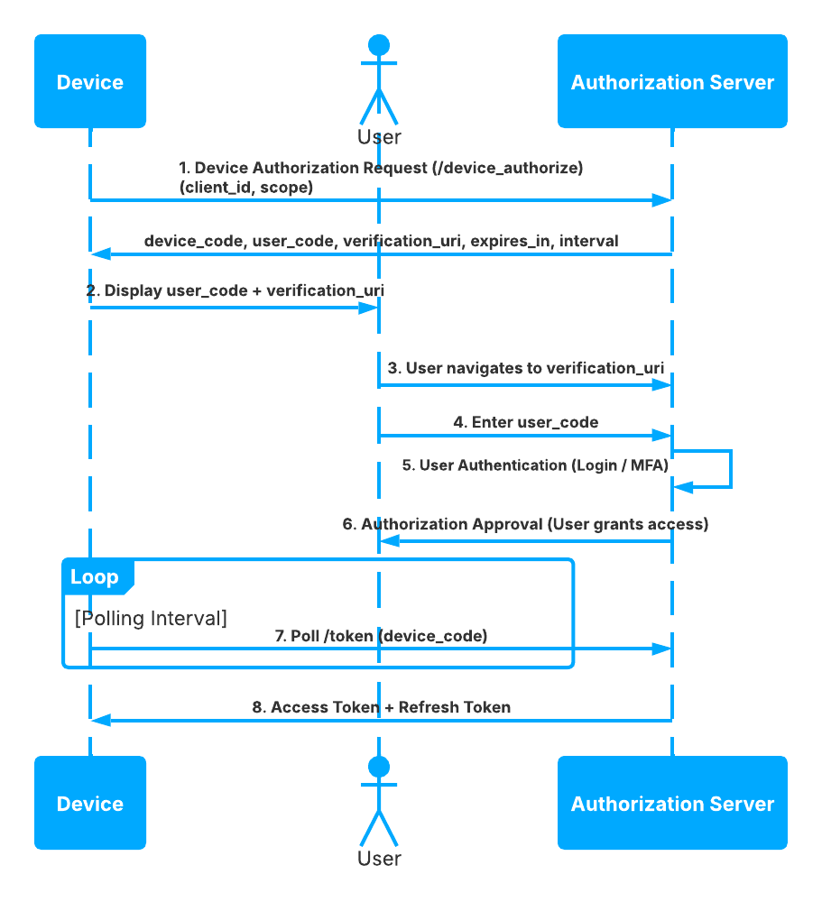

# Device Code

Authenticate devices with limited input capability by splitting the user interaction across two devices.

> Audience: Developers, CTOs
>
> Read this guide when building TV, console, kiosk, or CLI experiences that cannot host a standard browser login.

> Prerequisites
>
> - Application enabled for `device_code`
> - A user-facing verification page strategy
> - Polling logic with backoff in the device client



## Step-by-Step Sequence

1. The device posts to `/device_authorization`.
2. TokenIDP returns a `device_code`, `user_code`, and verification instructions.
3. The device shows the `user_code` to the user.
4. The user completes authorization on a secondary device.
5. The device polls `/token` with `grantType=device_code`.
6. TokenIDP returns tokens after approval.

## Working Example

## Example Device Authorization Request

```bash
curl -X POST https://localhost:5001/device_authorization \
  -H "Content-Type: application/json" \
  -d '{
    "client_id": "tokenidp-tv-app",
    "scope": "openid profile api.read",
    "device_metadata": "living-room-tv"
  }'
```

## Example Token Polling Request

```bash
curl -X POST https://localhost:5001/token \
  -H "Content-Type: application/json" \
  -d '{
    "grantType": "device_code",
    "clientId": "tokenidp-tv-app",
    "deviceCode": "dvc_01HQW6J2Q8N2K7P8A1J2M3N4P5"
  }'
```

## When to Use

- Smart TVs
- Command-line tools
- Shared-display devices

## When Not to Use

- Normal web applications that can use Authorization Code + PKCE
- High-frequency polling environments without rate control

## Security Notes

- Keep the device polling interval conservative.
- Expire unused device codes quickly.
- Treat the user code as short-lived and single-purpose.

## Common Pitfalls

- Polling too aggressively and creating avoidable load.
- Displaying the wrong verification URI or stale user code.
- Using Device Code when a normal browser session is available.

## Troubleshooting Tips

- If polling always fails, verify the user actually completed the approval step.
- If the user code is rejected, check code expiration and tenant mismatch first.
