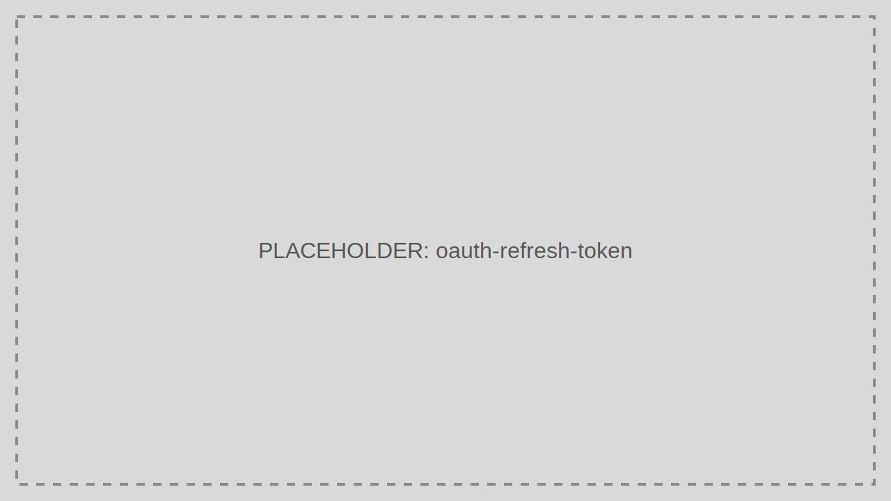

# Refresh Token

Renew an expired Access Token without forcing the user through a new interactive login.

> Audience: Developers
>
> Read this guide when your client already has a valid Refresh Token and needs a new Access Token.

> Prerequisites
>
> - The original flow must have issued a Refresh Token
> - The requested scopes must still be valid for the Application and User



## Step-by-Step Sequence

1. The client stores the Refresh Token securely.
2. The Access Token expires.
3. The client posts the Refresh Token to `/token`.
4. TokenIDP validates the token and client binding.
5. TokenIDP issues a fresh Access Token and may rotate the Refresh Token.

## Working Example

## Example Request

```bash
curl -X POST https://localhost:5001/token \
  -H "Content-Type: application/json" \
  -d '{
    "grantType": "refresh_token",
    "clientId": "tokenidp-react-dev",
    "refreshToken": "8d2a5d18-b8cb-44b9-9d5c-bccaf4877baf",
    "scope": "openid profile email offline_access api.read"
  }'
```

## Example Response

```json
{
  "isSuccess": true,
  "data": {
    "accessToken": "eyJhbGciOiJSUzI1NiIsImtpZCI6IjIwMjYtMDMtMTYifQ...",
    "refreshToken": "35b31ab0-53a1-4566-b2ff-4460c70d9ad3",
    "tokenType": "Bearer",
    "expiresIn": 3600
  }
}
```

## When to Use

- SPAs using `offline_access`
- Native apps
- Long-running user sessions that need silent renewal

## When Not to Use

- Stateless server jobs that should use Client Credentials instead
- Highly untrusted environments with no safe token storage strategy

## Security Notes

- Treat Refresh Tokens as highly sensitive bearer credentials.
- Rotate them when possible and revoke them when compromise is suspected.
- Never place them in URLs.

## Common Pitfalls

- Persisting Refresh Tokens in browser storage without compensating controls.
- Forgetting to request `offline_access` during the original authorization request.
- Using a Refresh Token after the associated Application has been disabled.

## Troubleshooting Tips

- If refresh suddenly stops working, inspect whether the token was revoked or the session was invalidated by policy changes.
- If a new Refresh Token is returned, replace the old one immediately in client storage.
