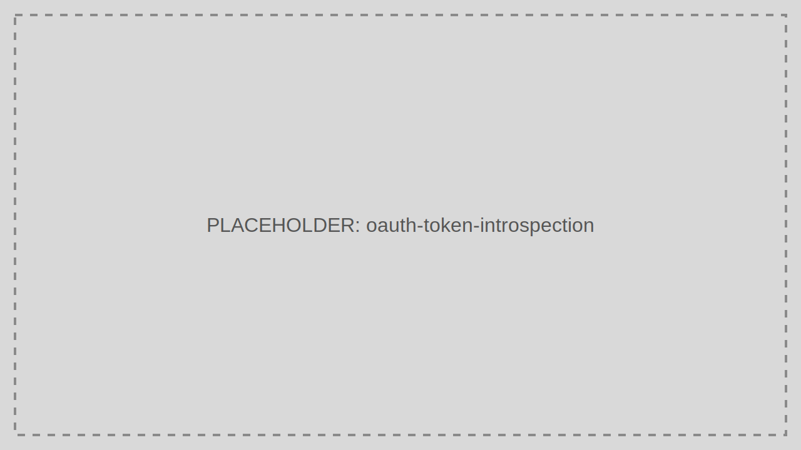

# Token Introspection

Check token activity and metadata when a relying service cannot validate or trust the token locally.

> Audience: Developers, CTOs
>
> Read this guide when you need active-state checks for opaque or reference-style token handling.

> Prerequisites
>
> - A token value to inspect
> - A service-side reason to prefer introspection over local JWT validation



## Step-by-Step Sequence

1. The relying service receives a bearer token.
2. The service posts the token to `/introspect`.
3. TokenIDP evaluates the token state.
4. TokenIDP returns whether the token is active and related metadata.

## Working Example

## Example Request

```bash
curl -X POST https://localhost:5001/introspect \
  -H "Content-Type: application/json" \
  -d '{
    "token": "eyJhbGciOiJSUzI1NiIsImtpZCI6IjIwMjYtMDMtMTYifQ..."
  }'
```

## Example Response

```json
{
  "isSuccess": true,
  "data": {
    "active": true,
    "sub": "42",
    "client_id": "orders-worker",
    "scope": "orders.read",
    "exp": 1773651025
  }
}
```

## When to Use

- Centralized token status checks
- Near-real-time revocation-aware resource access
- Nonstandard token consumers that cannot validate JWTs locally

## When Not to Use

- Every request to a high-throughput API when local JWT validation is sufficient
- Browser clients

## Security Notes

- Restrict who can call introspection.
- Avoid logging full token values.
- Prefer local validation for standard JWT resource servers unless active-state checks are required.

## Common Pitfalls

- Using introspection as a substitute for basic JWT validation knowledge.
- Sending tokens from front-end code directly to introspection.

## Troubleshooting Tips

- If introspection returns inactive, verify expiry, revocation state, and tenant context.
- If latency becomes a problem, cache negative and low-risk results carefully and review cache TTLs.
