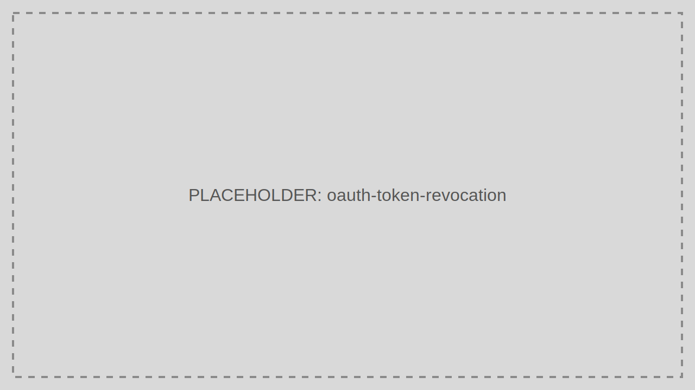

# Token Revocation

Revoke a Refresh Token when a session must be terminated or a credential is suspected to be compromised.

> Audience: Developers, CTOs
>
> Read this guide when you need to invalidate refresh capability before token expiry.

> Prerequisites
>
> - The Refresh Token value to revoke
> - A reason code or operator note for auditability



## Step-by-Step Sequence

1. The operator or client identifies a Refresh Token to revoke.
2. The caller sends the token to `/revoke`.
3. TokenIDP records the revocation event.
4. Future refresh attempts using that token fail.

## Working Example

## Example Request

```bash
curl -X DELETE https://localhost:5001/revoke \
  -H "Content-Type: application/json" \
  -d '{
    "token": "35b31ab0-53a1-4566-b2ff-4460c70d9ad3",
    "reasonRevoked": "user_sign_out"
  }'
```

## Example Response

```json
{
  "message": "Refresh token revoked."
}
```

## When to Use

- User sign-out from sensitive devices
- Compromise response
- Administrative session termination

## When Not to Use

- Routine Access Token expiry handling
- JWT validation in APIs that only need signature and scope checks

## Security Notes

- Revoke the token as soon as compromise is suspected.
- Keep audit details for who triggered the revocation and why.
- Combine revocation with logout and client-side token cleanup.

## Common Pitfalls

- Assuming revoking a Refresh Token instantly kills every Access Token already issued.
- Not storing the revocation reason, which weakens audit quality.

## Troubleshooting Tips

- If the user still reaches APIs, check whether they are using a still-valid Access Token rather than a revoked Refresh Token.
- If revocation appears ineffective, verify the client is not holding a newer rotated Refresh Token.
