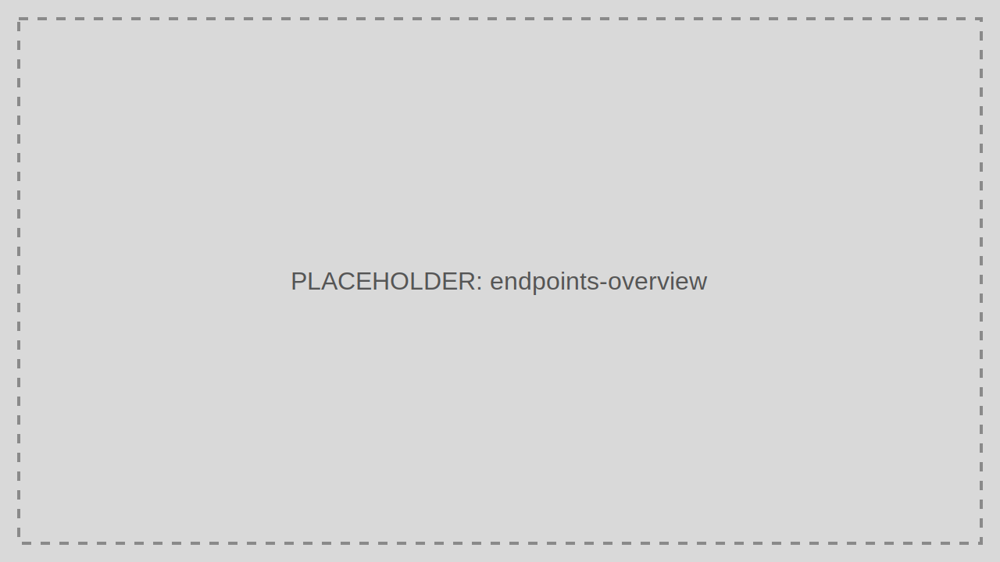

# Reference

This section describes TokenIDP behavior as a set of exact interfaces, request fields, endpoint contracts, and configuration details.

> Audience: Developers, CTOs
>
> Use the Reference section when you need exact names, payloads, and endpoint behavior.



## Reference Pages

- [Supported Specifications](./supported-specifications.mdx)
- [API Scopes and API Resources](./api-scopes-resources.mdx)
- [Authorize Endpoint](./endpoint-authorize.mdx)
- [Token Endpoint](./endpoint-token.mdx)
- [OpenID Configuration Endpoint](./endpoint-openid-configuration.mdx)
- [JWKS Endpoint](./endpoint-jwks.mdx)
- [UserInfo Endpoint](./endpoint-userinfo.mdx)
- [Revocation Endpoint](./endpoint-revoke.mdx)
- [Introspection Endpoint](./endpoint-introspect.mdx)
- [Logout Endpoint](./endpoint-logout.mdx)

## Working Example

```bash
curl https://id.example.com/.well-known/jwks.json
```

The response contains the public signing key material that APIs and clients use to validate TokenIDP-issued JWTs.

## Common Pitfalls

- Mixing tutorial guidance with endpoint contracts.
- Assuming TokenIDP implements every optional OAuth extension.

## Troubleshooting Tips

- When a client library behaves unexpectedly, compare its request format against the endpoint reference instead of relying on defaults.
